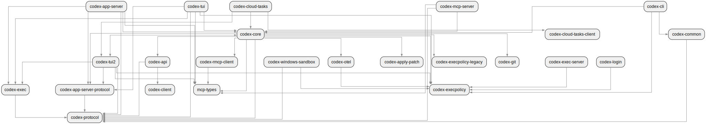
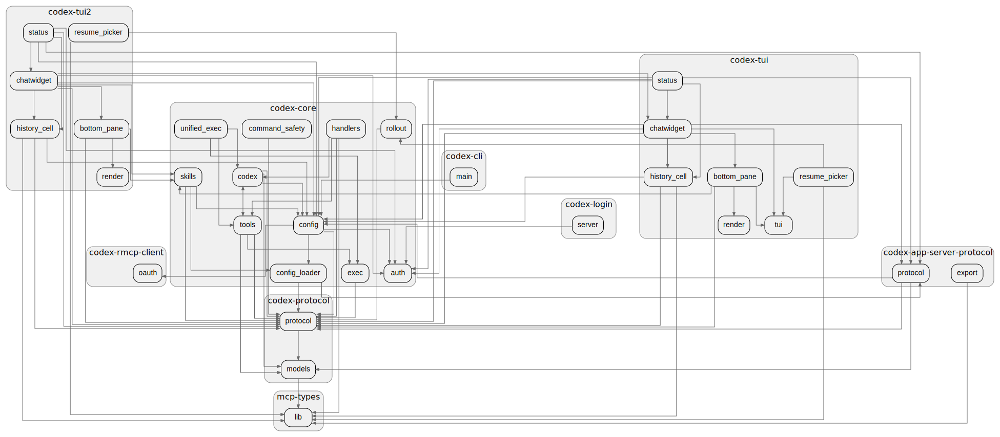
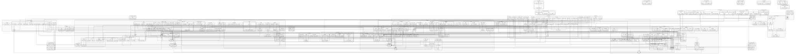
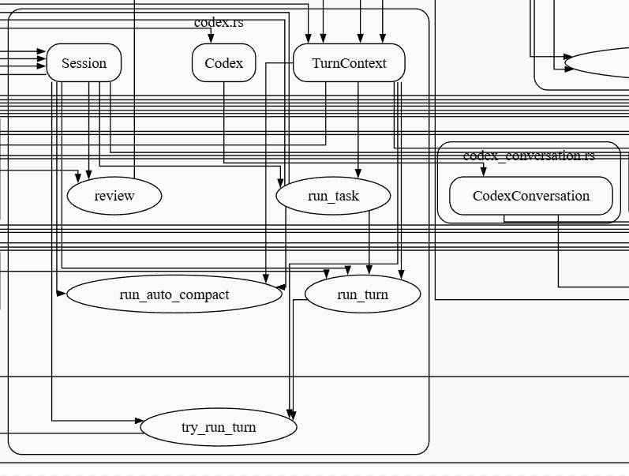

# llmcc

**llmcc brings multi-depth architecture graphs for code understanding and generation.**

Our goal is to build a multi-depth, tree-like context / architecture view of a codebase, so a coding agent can *walk up* (zoom out) for structure and intent, then *walk down* (zoom in) to the exact crates/modules/files/symbols it needs—getting a highly comprehensive understanding of any codebase (any programming language).

## Supported Languages

| Language | Status | Notes |
|----------|--------|-------|
| Rust | ✅ Supported | Full support for crates, modules, and symbols |
| TypeScript | ✅ Supported | Includes TSX, supports ES modules |
| C++ | 🔜 Planned | Coming soon |
| Python | 🔜 Planned | Coming soon |

## Why multi-depth graphs?

People (and coding agents) need to understand systems from different dimensions. Sometimes you need the high-level architecture to see boundaries, ownership, and how subsystems connect; other times you need the low-level implementation details to make a safe, precise change. llmcc provides multiple depths so you can choose the right “distance” from the code for the task.

| Depth | Perspective | Best for |
|------:|-------------|----------|
| 0 | Project | multi-workspace / repo-to-repo relationships |
| 1 | Library/Crate | ownership boundaries, public API flow |
| 2 | Module | subsystem structure, refactor planning |
| 3 | File + symbol | implementation details, edit planning |

## Walkthrough: Codex (midterm size multi-crate rust project)

This repo includes many examples under [sample](sample). Download and open them in browser for the best viewing experience.

### Depth 1: crate graph

<p style="height: 200px; text-align: center;">
	
</p>

### Depth 2: module graph

<p align="center">
	
</p>

### Depth 3: file + symbol graph

<p align="center">
	
</p>

Here's a small portion of the graph at depth 3, showing the core abstraction layer for prompt handling in Codex. Developers and AI agents can quickly grasp the architecture by examining this view.

<p style="height: 200px; text-align: center;">
	
</p>


## Performance

llmcc is designed to be very fast, and we will try to make it faster.

The repo contains benchmark for many famous project output here: [sample/benchmark_results_16.md](sample/benchmark_results_8_linux.md).

Excerpt (PageRank timing, depth=3, top-200):

| Project | Files | LoC | Total |
|---------|-------|-----|-------|
| databend | 3130 | 627K | 2.53s |
| ruff | 1661 | 418K | 1.73s |
| codex | 617 | 224K | 0.46s |

## CLI: generate graphs

Build the binary:

```bash
cargo build --release
```

Generate a crate-level graph for Codex (DOT to stdout):

```bash
./target/release/llmcc \
	-d sample/repos/codex/codex-rs \
	--graph \
	--depth 1
```

Generate a PageRank-filtered file+symbol graph (write to a file):

```bash
./target/release/llmcc \
	-d sample/repos/codex/codex-rs \
	--graph \
	--depth 3 \
	--pagerank-top-k 200 \
	-o /tmp/codex_depth3_pagerank.dot
```

Render DOT to SVG (requires Graphviz):

```bash
dot -Tsvg /tmp/codex_depth3_pagerank.dot -o /tmp/codex_depth3_pagerank.svg
```

For generating sample graphs:

```bash
just gen rust
```
