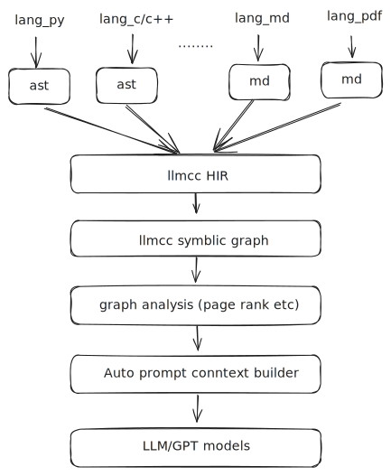

# llmcc

*"Prompts are the modern assembly language, models are the modern CPU."*

llmcc is a universal context builder for any language, any document.

## abstract

llmcc explores automated context generation through symbolic graph analysis. bridging the semantic gap between human-written code/documents and AI model understanding, using modern compiler design principles.

## design



## examples

```llmcc --dir codex/codex-rs --lang rust --design-graph --pagerank --top-k 100```

**codex**: [graph](https://edotor.net/?engine=dot?engine=dot#deflate:eNq1Wm1v47gR/r6/Isjnpjb1al+xBXaDBZL20g3i7O2HohBombF1oV5OojZxi/vvHXJoc6T4fLClfNn16OV5ZobDmeEoq2xd82pzcV3mFU/VfV3+KlJ18b8PFxdNu8R7qWwbJepkai5fXEi+FPLjJa+qq0bUP0R9+TdzvVFbKT4+ZVKKFV5JS1nWH2W23qh1LbZ4sfAu/m0hrsuVeL0TTcPXAqhT+FXWl3+5eGqlTCquNh8vJ3mhJunkGzA1k/9ueLH+LYN/Jql+Ff+9gjtOmUlTp3g9yRE5qXbQf62bn5g3u/zPThO2V+U9tDjI7/lI//shF7Oui5c8fRbF6iqVmSjUiW5mzrhrfP8ck7oqoHPNT22LPztii9e1Bd46NU6mbnVaqTJVlhIsOcsMYMcl4VmhNQ/m+yDwwz3Nol2mZZ7zYjUKSRTsSUJHcpdWg61IqyTNV2YJjoWT31+Csl1dKd48Nycuhe/v1f9UVV9+nBtNRANjCGwYsyfm0d5TUUypxmQJ4iOuCv7QVeftPs8t+KNx+EBD6AbcKGUMYsylsmi+57uB2wN2/J+QetMjXgx7XjSYuxRSVqLgVXaVw1V5agRGLhncS148bitxnnVHVMK9hT9rrkQiszxTSaO4ahug2cqSr/4070V9H9Ti1N3mcoVWZshaAnkvZ8/YPmbcTvtWZE+ZWH15FekNZD8p6mF0OlU3kw1CNZMW4RMB+CaGwr0OzKPbXW7vuUo3D22hslyMoUONUKY2y62GSjcmGbjczCLSkBRQvBuusrK44wUU74GOSAlgkiOiiSDigXmnNJRFAR3YWPymUuwhqQZsGrs+yC3CYiOkfA//Nxq4V3o9F+lf6rqsx4rxeOooom63+SB+a0WjPreZXA117ko8cWhMEkcckbaCHYyqm6xRZb0dMao2iKjpHXvQYX/K1oMJAcO41pWcgDRO0N6CLkNJ4IpJDwEhmXXX71OrNsNoOCCYLeiCJGQHktB7JMJeEiJHkdBtwV8y8XKbwz59Dw1+AHiSaXSTBFwaCmeHqoFd2FFyEa0CusyaiHUKROyQAu+RivrlKHQlMYqOeGFE8xtENDuKFGS/m4ffIwD2ediLjjQxcbeJ0Tqf2MQELrXr48L+YP09U5t/NGXxtVVVe15Xgx4E04RGdsfr5AWwk18BXCalgTer6yp94B1R6qaF6vhuWm00OtEqOHZum731flXKLN2eOgJwHR6YChz5ooKFPNc61MHYWCGcySGknrtF/1Sv73SaOzN6e3S8XkPvYuDoGUSXWbdhv1ZqDK6yUj2zAmfWvXluSPfQd6T5CRB1g7aR/jz0qTvPPvIc8KUCLJr/D0bhvBuF0EqeN+8Lo3GnbE6RP56y+fNjU7bpW8u0R049k05J/6PV+VepIMWnpi072zKjiDFMZkscWPqeC/dZb6hn+9kR6eJjh1vWm1CC01UJ3jn1hOsdbI5vz5u77ZR42xtnpslgvttScbcC3DXr4ZQ7weR10tNFbrEey2dRfNNxOi5dGDvbYtdALaDaL8tXzFbjMnr+sTEa6019ax1j5w3Q3LH453K9zoo1BvyQnohogyGPwPYAl9geqV9hXPZ/yNMhk7U+fW1O528mM4cd25vlKtj0iUE+dZDmisojYJhD1Q2vC0id5/eZWhv9M8/LYuJUw3ziHTOrN3dV7alfCRidnjzqTwRcymvocc+yBvhx2omH6iS1zXIck1n+nvFzqVSZ3/NCDCJbGhh4txC7c1HotrWrnvf6DKZPh4PYKo2SlJAkJd/iJMi1OiRjtdkgGvgfOwznOLejrzdcfc9Wa6EGcaQA82JgMDO51olNO1z682bZnJk1Di2TZoYYR1SzeV3aZ+QUl9allAvF1XgR0hhMM5U2PRwhdpnqn2L7OStWkNwG8T6LbbLJMD0xNy9kISnfss2LB1FAP8yXcpiZtYGx/2k0DE+yrDM6qKnLH1x+xUAezb3c4tIdErophTf889SO1X6WIlvdc+Y9KDjOQAvTDKJ4gWRbQRAYHtJFTkkNeFWfasFH858CQA6A9Fu3pnR++xly60JIHEkPTmeUWwJy0uygEz3r6k1YfJeDFuazzi1sEujY9QhgcDqyH4qyHWRCc5M7TTrnf6tWsInhNJRXClKFEMUg/tbA6YNQjmfYOWH1SRmB0vu5rRs1muMrDZksNSZ+mHS8EQm1Os8KPqwwp9A3AKuyWJggiJkuzBaSN5vrAZ/z98uqgRL7hwF4InN8Lp5uC1Cqbis1ZFj6trJNsh1u0/t0FpIaZ7yCgTTqjrLuxpDabyg6tyZzvleRDm689LDCdF34IZYOKjWbc/djzQsohVmlxqgAb5oinxysIq+XNOxHnMHGYsKYpLxe9efQ5NAheFMWkMQXLUTgCKz93paRzy2Rq+zf60wNjGJQ93lVvhQJVnRzPnZcMYlf20ndFudOX/cL2S7hzGszrzmSGGBIynbwSmI39t78VcvCKDq0rCc4Am72VpMjczG9uPq7/vSpL8DpxQgzI3hGYBERfLzjo+ARIWBGCN4KYUyECAFChJ5Sgd7x50aIKYAV8LEZ8qBucwQgv0N6nT4UxFSY01emVAioQN+xBjB0mz+lUuBTKUb3MPRpYN+LqOusZN21k+yTaK8XUMlHWxia76NiDDXz8UnPaoYu8OyKooCLGCOdhwsXoQleQOPASqGV7ArZ96LOk6gYetJn1Ee+Rx/0LYF9EiFD1NLvQPoIybpSSCXrW3/WeW9O7wVT+l7AqOmB1wlT1IzZOLURSAU279xiVAo7r9nwDDoGBR01gznxWNiJoxC1ZGhB6FGCMKB7M4xobIdIEFnJRioVGAZHxKiWkUeDMeo4xUp2KaPOJo86qkRhR4o7mHHnPdTFwyWJpzQJxIz6KLaaWcmnbrGS15ECwPz9w4f/A1p9kqY=)


```llmcc --dir kimi-cli --lang python --design-graph --pagerank --top-k 80```

**kimi-cli**: [graph](https://edotor.net/?engine=dot?engine=dot#deflate:eNq1WdtuGzcQfc9XCH5uIpF7kdTABRLHSYPaQGA59UNRCPQuLTGmdjdcrh21yL+XN2tmFblAsNRL4CMxc2aGM4dDqhQrxZr16KzeNKzQn1T9hRd69O+L0ajtbv13hexazdVy4j4ejSS75fL05F5sxLKQ4uS1+7TVW8lP74SUvPSfFLWs1akUq7VeKb71H1Z09FcwcHFxefLL6K6TctkwvT49GW8qPS7Gn1uu2vE/a1atvgrzz9gyvTRM41YV4yfasZSbV8321/zk72A5w5ZNJA+i5GoIQ1FXd2JlSQjZsZAezWVdchmHg0IkZL7jeLPilf4g61sm2yE8zNqxNNl8R0NJnyaK/ekE7MNeX9Z11a5rveBMFeszF3SctKWQNjrd8S1424q6GkKx4ZqVTDOXtOmOJIGkve2E1KJabE17bEzBbRr9Rq3ibBMKK0FpDD7FiitJdixpumOJuT05xJFP0PaoB1HwNg4HKuk82XHc1Or+nVA2ZbHSRaAM8qzfO4uGF1E2noYt+X5IgslhCX7V1p38SR2GMn53ycQgDbPs45JXj0zx6otw5btL1Ax47IoruyIyGQE2ksO2NI05A5i84l873urBnI9CcVdtGQgOqmixaSQPx+hA5XF0xc6Ua1REmh0IsW2MvvJoMabokICMLmyVDaVYLkUl9HLpah1oEkjljXEiWiRzSFyCFe5I+4QUIkGJ00x37aJijT0D46YQKTik8A+zPspuWWT/cEUBQ1AK6nHJvi00b9orzoo1L6MGRyC4jPxQ9YOpWDBkqWbAlBxQrHOlahVbtmBSyqb48NX8m45Ql87Onj5mMFm+ZcX9dX295u873UXoOFwq9KntDp5i9JlTTNe1GXJ/7hhD570Smr8XclAkzoWxoeXjR2vPBQM9DQpybRYa2e2ktlPgwIuGZ+20kK0TezRm7BHa2xkvB1fjHiFJ6Y4RKtHeOiLlcmVMuchAQqAQl4vudqjmey7N2vu+gKSQSgLy+Ikptmkj8NVl/ZxgEYqmXXvpueERsvnIb8etM7dXKARK8z3Xxfrz1UUctjtrbe9oI1AkRvbLiE2njDkXGegxhRb/oHgTqyKNKdfcFEqSzqJXSC8ogq6q8+NQQVgwh8yQhpT1Eaoe9iqZo5lHXfFGsoJHLQ9n0VUInJ4pRck01RqRsGGh+imig4I8L4WOHxo6r9McddrwIf+QiBAKI3IKjX1ttPQIipyi2GZIIaty8DXUM5YbY6YvytDhGUXjT7seznZrrPTncVDJLN07Afy8EH3/8HiXHUdWdrMQ5kL3G66ttFyIVh/jUJ3+zyyZPDNLdj/7Lj3pPbKZC+KGVaW9J0quh013ncFrLuW4cU+ETrzg4kvgYrO0M94Zk/KdaI0YbKOQSvHAHwR/dMWJHkpAxP7g2/OHgc+/O7p7vr2tmSr3LjgEHa1KVNrc4QbSNdbMc1dhCq233HsHOlZup+gtA3L75uyTex78aOpoICUrml64OXpqgLY/M21Rh8foCI/gh2p3BtuaoBd3zZsLk48/TT5uhF5fMnVf1o9V9EQnE3Qfy35sHvvYwiPnGj1UpWhyczmxPwHFTjF6f8smB1McPa2EoicQ6FY7S12aAjZ1dCwxnAJxDmK4sKuGy4Qne2YvcxgHrMWPVdPp2FuZQ7fkSJWuuuoYhYp/CsmxCtlfXAbv3D5bim40OUjB8nczCNRqe15ptY2dzwmaBqpk9PI3Q/0a/k4IAlkPZA5M8bKZA/jvLHFg7ldNHCATj2YeUYfSHugj75C5kqOFuQPUO0G8F3SGUfCJeEfSwO09oRjMet9MMXqyMe+5NcfZoCEa/x31yaFzj7zLxAdAvV+5T0lCeyjBKwOiPRSyF1Du+ZIUxWPOLQsmGCQ5RtkMo7z333IfeeK9zIKVOS6JXlICShOMQlJSnxQyx4hOeqi3Mul9F5wOKO2tzKY9FBgocjOA4GZAT475fGUYkB7Kgye+wDKf5tQnZY5BqKiA8mBkhkoqC1kgPZRgRFOMQtwZwcWQ4QbJcKBZL7TMe0y8W3mw77c4J7igAkq8y3mw74PLQ5eF77zNxPj8/cWL/wCmDFm0)


## run

```bash
llmcc [OPTIONS] < --file <FILE>...|--dir <DIR>... >
```

**Input** (required, one of):
- `-f, --file <FILE>...` — Individual files to compile (repeatable)
- `-d, --dir <DIR>...` — Directories to scan recursively (repeatable)

**Language** (optional):
- `--lang <LANG>` — Language: 'rust' or 'python' [default: rust]

**Analysis** (optional):
- `--design-graph` — Generate high-level design graph
- `--pagerank --top-k <K>` — Rank by importance (PageRank) and limit to top K
- `--query <NAME>` — Symbol/function to analyze
- `--depends` — Show what the symbol depends on
- `--dependents` — Show what depends on the symbol
- `--recursive` — Include transitive dependencies (vs. direct only)

**Output format** (optional):
- `--summary` — Show file paths and line ranges (vs. full code texts)
- `--print-ir` — Internal: print intermediate representation
- `--print-block` — Internal: print basic block graph

**Examples:**
```bash
# Design graph with PageRank ranking
llmcc --dir crates --lang rust --design-graph --pagerank --top-k 100

# Dependencies and dependents of a symbol
llmcc --dir crates --lang rust --query CompileCtxt --depends
llmcc --dir crates --lang rust --query CompileCtxt --dependents --recursive

# Cross-directory analysis
llmcc --dir crates/llmcc-core/src --dir crates/llmcc-rust/src --lang rust --design-graph --pagerank --top-k 25

# Multiple files
llmcc --file crates/llmcc/src/main.rs --file crates/llmcc/src/lib.rs --lang rust --query run_main
```

## python

Install the published package from PyPI:

```bash
pip install llmcc
```

With the package available, invoke the API directly:

```python
import llmcc

help(llmcc.run)

graph = llmcc.run(
	dirs=["crates/llmcc-core/src"],
	lang="rust",
	query="CompileCtxt",
	depends=True,
	summary=True,
)
print(graph)
```
